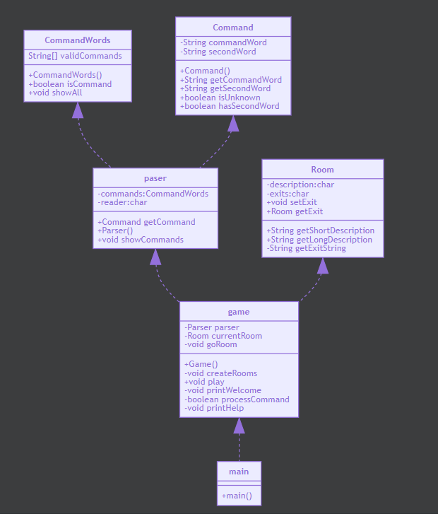

# 软件工程实训任务一：代码规范与标注

## 任务目的

* 理解软件代码规范的重要性
* 理解代码变化对软件质量带来的影响
* 掌握基于Git的个人代码版本维护方法
* 掌握MarkDown文件编写方法

## 任务内容

* 阅读、理解和标注样例代码
* 分析和学习代码质量特征、设计方法和编程风格
* 运用所学方法，对开源代码进行标注
* 对样例工程进行简单功能扩充和维护

## 任务要求

1. 阅读和描述样例工程

    * fork样例工程，并clone到本地仓库
      
    * 在本地开发环境上运行样例工程，理解样例工程的代码逻辑；
      
      
* 精读样例工程软件代码，描述代码结构及部件组成；
  ##项目运行过程分析：

    * 运行主函数时，自动创建一个Game类对象，同时会调用Game类的createRoom方法,然后调用Game类的play方法
    * createRoom方法调用Room类创建房间并建立对应房间的描述，并规定程序运行开始时处于outside
    * play方法首先调用printWelcome()方法，对玩家表示欢迎并给出相应操作的提示，然后用户输入命令字符串，由parser类中的私有成员变量read记录
    * 进入循环，调用parser类的getCommand()方法,将用户输入的字符串命令传入变量，并将输入的字符串分为两个单词分别保存在Word1，Word2之中
    * 将firstWord、secondWord作为参数传入command（）方法中进行赋值
    * 判断两个词是否为空
    * 进入processCommand首先判断输入的命令的第一个单词是否为空，若为空则输出不识别用户命令，将返回值false传给finished，使程序继续运行。
    * 若第一个单词不为空，将第一个单词进行与help，go，quit进行比较。
        * 若与help相同，调用printHelp方法，输出对应话语，调用showCommands方法提示玩家可以进行的操作
        * 若与go相同，调用goRoom方法并执行，判断是否有第二个单词，如果没有输出go where？提示用户输入去的方向，
          若有，与可去方向比对，相同就进入对应房间并输出该房间的描述和可去方向，若没有则提示用户这个方向没有们，并让用户再次输入。
        * 若与quit相同，调用quit方法，将wantToQuit赋值为true，结束运行
    * 以UML图描述样例工程的组成及结构图（类及类之间的关系）
      * 可结合markdown语法和mermaid插件绘制所需uml图形

   ```mermaid 
   classDiagram
          Command <|--Parser
          CommandWords<|--Parser
          Parser<|--Game
          Room<|--Game
          Game<|--Main
          class Game{
          +Room currentRoom
          +createRooms()
          +play()
          +printWelcome()
          +processCommand()
          +printHelp()
          +goRoom()
          +quit()
          }
          class Command{
          +String commandWord
          +String secondWord
          +getCommandWord()
          +getSecondWord()
          +isUnknown()
          +hasSecondWord()
          }
          class CommandWords{
          +String[] validCommands
          +CommandWords()
          +isCommand(final String aString)
          +showAll()
          }
          class Parser{
          +CommandWords commands
          +Scanner reader
          +Parser()
          +Command getCommand()
          +showCommands()
          }
          class Room{
          +String description
          +Room(String description1)
          +setExit(String direction, Room neighbor)
          +String getShortDescription()
          +String getLongDescription()
          +String getExitString()
          +Room getExit(String direction)
          }
          class Main{
          +Main()
          } 
                
2. 标注样例工程中的代码

    * 基于javadoc规范标注代码，对包、类、方法、代码片段、参数和语句等代码层次进行注释（可参考Game类的标注样例）；
      下面截取其中几个方法的注释标识如下
      
* 创建游戏并初始化内部数据和解析器.

  public Game() {
  createRooms();
  parser = new Parser();
  }

  游戏主循环，直到用户输入退出命令后结束.

  public void play() {
  printWelcome();

       // Enter the main command loop.  Here we repeatedly read commands and
       // execute them until the game is over.
      
       boolean finished = false;
       while (!finished) {
           Command command = parser.getCommand();
           finished = processCommand(command);
       }
       System.out.println("Thank you for playing.  Good bye.");

  }


* 执行用户输入的游戏指令.

@param command 待处理的游戏指令，由解析器从用户输入内容生成.   
@return 如果执行的是游戏结束指令，则返回true，否则返回false.
private boolean processCommand(final Command ){
boolean wantToQuit = false;

        if (command.isUnknown()) {
            System.out.println("I don't know what you mean...");
            return false;
        }
      
        String commandWord = command.getCommandWord();
        if (commandWord.equals("help")) {
            printHelp();
        } else if (commandWord.equals("go")) {
            goRoom(command);
        } else if (commandWord.equals("quit")) {
            wantToQuit = quit(command);
        }
        // else command not recognised.
        return wantToQuit;

}

* 注释后的代码提交到本地代码库后，同步推送到远程代码仓库；
* 可参考ESLint、github/super-linter等开发插件了解关于代码规范的相关知识；
  CheckSytle-IDEA 插件(针对IntelliJ IDEA开发环境)，并针对java源代码文件开启“Sun Checks”规则检查，       
  针对代码中出现的注释、分行、缩进、括号位置、变量声明、方法声明等等格式警告进行代码格式规范整理；     
  
###代码设计缺陷

* Game类的processCommand()方法中，当用户输入的命令被辨认出来以后，有一系列的if语句用来分派程序到不同的地方去执行。
  从面向对象的设计原则来看，这种解决方案不太好，因为每当要加入一个新的命令时，就得在这一堆if语句中再加入一个if分支，
  最终会导致这个方法的代码膨胀得极其臃肿

* 可用switch语句替换点多次if，else语句

* 修改前的代码  
  String commandWord = command.getCommandWord();  
  if (commandWord.equals("help")) {   
  printHelp();   
  } else if (commandWord.equals("go")) {   
  goRoom(command);   
  } else if (commandWord.equals("quit")) {   
  wantToQuit = quit(command);   
  }
* 修改后的代码  
  String commandWord = command.getCommandWord();   
  switch (commandWord){   
  case "help":   
  printHelp();   
  break;   
  case "go":   
  goRoom(command);   
  break;   
  case "quit":   
  wantToQuit=quit(command);   
  break;    
  }

